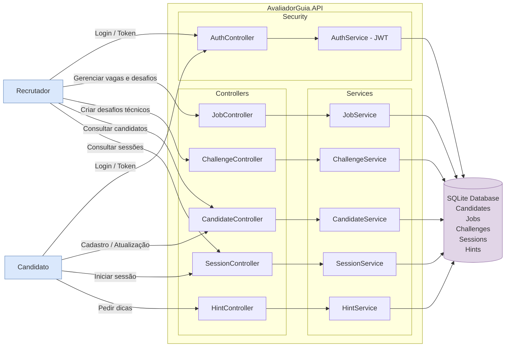

# Avaliador-Guia API (C#) – O Futuro do Trabalho

API RESTful em **ASP.NET Core Web API** que simula uma plataforma de **entrevistas técnicas com tutor de IA (simulado)**.  
O foco não é apenas ver se o candidato “acertou o código”, mas **acompanhar o processo de pensamento**: quantas dicas pediu, em que ponto travou, como evoluiu a solução.

Projeto alinhado ao tema **“O Futuro do Trabalho”**, com IA atuando como parceira do ser humano e não como substituta.

---

## Integrantes do Grupo

- Breno Silva - RM97864
- Enrico Marquez - RM99325
- Gustavo Dias - RM550820 

---

## Objetivo do Projeto

No futuro do trabalho, entrevistas técnicas precisam ser **mais humanas, justas e pedagógicas**.  
O sistema **Avaliador-Guia** propõe:

- Uma API que gerencia **candidatos, vagas, desafios técnicos e sessões de entrevista**.
- Um “**Tutor IA**” (simulado) que responde dúvidas do candidato em formato de **dicas progressivas**, sem entregar o código pronto.
- Registro completo da sessão: código final, dicas usadas, tipo de dificuldades (lógica, otimização, edge cases).

Isso permite que o recrutador avalie **como** o candidato pensa, colabora e aprende durante o desafio – um modelo mais próximo da realidade do trabalho em times de tecnologia.

---

## Arquitetura e Tecnologias

- **Linguagem:** C#  
- **Framework:** ASP.NET Core 8 – Web API  
- **ORM:** Entity Framework Core  
- **Banco de Dados:** SQLite (`avaliador_guia.db` – arquivo local na pasta do projeto)  
- **Documentação:** Swagger (Swashbuckle)  
- **Padrão REST:**  
  - Endpoints organizados por recurso  
  - Uso correto de **GET / POST / PUT / DELETE**  
  - Status codes adequados (200, 201, 204, 400, 404)  
- **Versionamento da API:** rotas sob `/api/v1/...`

---
## Flowchart



## Domínio do Sistema

### Entidades principais

- **Candidate**
  - `Id`
  - `Name`
  - `Email`
  - `Seniority` (enum: `Junior`, `Pleno`, `Senior`)
  - Relação: 1:N com **Session**

- **Job** (vaga)
  - `Id`
  - `Title`
  - `Description`
  - `TechStack`
  - Relação: 1:N com **Challenge**

- **Challenge** (desafio técnico)
  - `Id`
  - `Title`
  - `Statement` (enunciado)
  - `Language` (ex: C#, Java, Python)
  - `Difficulty` (Fácil, Médio, Difícil)
  - `JobId` → FK para **Job**
  - Relação: 1:N com **Session**

- **Session** (sessão de entrevista)
  - `Id`
  - `CandidateId` → FK para **Candidate**
  - `ChallengeId` → FK para **Challenge**
  - `StartedAt`
  - `FinishedAt`
  - `Status` (enum: `EmAndamento`, `Finalizada`)
  - `FinalCode` (código entregue pelo candidato)
  - Relação: 1:N com **Hint**

- **Hint** (dica do tutor)
  - `Id`
  - `SessionId` → FK para **Session**
  - `DifficultyArea` (enum: `Logica`, `Otimizacao`, `EdgeCases`)
  - `CandidateQuestion` (dúvida do candidato)
  - `TutorAnswer` (resposta do “tutor IA” – texto simulado)
  - `CreatedAt`

---

## Fluxo de Funcionamento (Visão Geral)

**Fluxo típico de uso da API:**

1. **Cadastro da vaga (Job)**  
   O recrutador registra uma vaga com título, descrição e stack tecnológica.

2. **Cadastro do desafio (Challenge)**  
   Para cada vaga, é criado um desafio técnico alinhado com a realidade da função.

3. **Cadastro do candidato (Candidate)**  
   O candidato é registrado com nome, e-mail e senioridade.

4. **Criação da sessão (Session)**  
   A API cria uma sessão ligando um `Candidate` a um `Challenge`.  
   Status inicial: `EmAndamento`.

5. **Durante a sessão – pedidos de dica (Hint)**  
   - O candidato pode enviar uma pergunta ao tutor.
   - Informa o tipo de dificuldade: lógica, otimização ou edge cases.
   - A API responde com uma dica textual (simulando um tutor IA) e registra tudo no banco.

6. **Finalização da sessão**  
   - Ao final, o candidato envia o `FinalCode`.
   - A sessão é marcada como `Finalizada`, com `FinishedAt` preenchido.

7. **Consulta de sessão**  
   O recrutador consulta a sessão para entender:
   - Quantas dicas foram usadas;
   - Que tipo de dificuldade foi mais frequente;
   - Qual foi o código final.

---

## Fluxo de Dados (para Draw.io)

Sugestão de diagrama para o arquivo Draw.io:

**Blocos principais:**

1. **Recrutador (ator)**  
   ↓  
2. **Cliente REST (Swagger / front futuro)**  
   ↓  
3. **AvaliadorGuia.Api (Web API)**  
   - Controllers  
   - Services (regras de negócio)  
   - EF Core / DbContext  
   ↓  
4. **Banco de Dados SQLite (`avaliador_guia.db`)**

**Fluxo sugerido para o diagrama:**

1. **Recrutador → API**
   - `POST /api/v1/Jobs`
   - `POST /api/v1/Challenges`
2. **Candidato → API**
   - `POST /api/v1/Candidates`
3. **Sistema de Entrevista → API**
   - `POST /api/v1/Sessions` (cria sessão)
4. **Candidato em sessão → Tutor**
   - `POST /api/v1/Hints`
   - API grava Hint no banco e retorna `TutorAnswer`
5. **Candidato → API**
   - `PUT /api/v1/Sessions/{id}/finish` (envia código final)
6. **Recrutador → API**
   - `GET /api/v1/Sessions/{id}` (consulta sessão completa: candidato, desafio, dicas, código final)

No README, pode referenciar o arquivo Draw.io assim:

> O diagrama de fluxo de dados encontra-se em:  
> `docs/fluxo-entrevista-avaliador-guia.drawio`

---

## Endpoints Principais (API v1)

> Base URL (desenvolvimento): `http://localhost:5000`

### Candidates

- `GET /api/v1/Candidates` – lista todos os candidatos  
- `GET /api/v1/Candidates/{id}` – obtém um candidato por id  
- `POST /api/v1/Candidates` – cria um candidato  
- `PUT /api/v1/Candidates/{id}` – atualiza um candidato  
- `DELETE /api/v1/Candidates/{id}` – remove um candidato  

### Jobs (Vagas)

- `GET /api/v1/Jobs`  
- `GET /api/v1/Jobs/{id}`  
- `POST /api/v1/Jobs`  
- `PUT /api/v1/Jobs/{id}`  
- `DELETE /api/v1/Jobs/{id}`  

### Challenges (Desafios)

- `GET /api/v1/Challenges` – inclui o Job relacionado  
- `GET /api/v1/Challenges/{id}`  
- `POST /api/v1/Challenges`  
- `PUT /api/v1/Challenges/{id}`  
- `DELETE /api/v1/Challenges/{id}`  

### Sessions (Sessões de Entrevista)

- `GET /api/v1/Sessions` – inclui Candidate, Challenge e Hints  
- `GET /api/v1/Sessions/{id}`  
- `POST /api/v1/Sessions`  
  - Body:
    ```json
    {
      "candidateId": 1,
      "challengeId": 1
    }
    ```
- `PUT /api/v1/Sessions/{id}/finish`  
  - Body:
    ```json
    {
      "finalCode": "// código final entregue pelo candidato"
    }
    ```

### Hints (Dicas do Tutor)

- `GET /api/v1/Hints/session/{sessionId}` – lista todas as dicas de uma sessão  
- `POST /api/v1/Hints`  
  - Body:
    ```json
    {
      "sessionId": 1,
      "difficultyArea": 0,
      "candidateQuestion": "Estou com dúvida na lógica da solução."
    }
    ```

---

## Versionamento da API

A API está versionada via **rota**:

- Versão atual: **v1**
- Todos os endpoints seguem o padrão:  
  `GET /api/v1/...`, `POST /api/v1/...`, etc.

Isso permite evoluir a API futuramente (ex.: `/api/v2/...`) sem quebrar clientes existentes.

---

## Como Executar Localmente

### Pré-requisitos

- .NET SDK 8 instalado  
- Git ou download do código `.zip`

### Passo a passo

1. **Clonar o repositório ou extrair o .zip**

   ```bash
   git clone https://github.com/Gustavo-Dias23/AvaliadorGuia

2. **Restaurar dependências**

- dotnet restore


3. **Executar a aplicação**

- dotnet run


4. **Acessar o Swagger**

- URL padrão: http://localhost:5000/swagger
